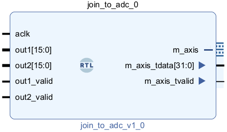

# Cores for splitting and joining AXIS data

Here are the cores we use for splitting and joining AXIS data.

## split_from_dac

The first core splits 

### Block


### Code

The code has two parameters

```verilog
module split_from_dac #
(
  parameter integer PADDED_DATA_WIDTH = 16,
  parameter integer AXIS_TDATA_WIDTH = 32
)
```

Inputs

```verilog
(* X_INTERFACE_PARAMETER = "FREQ_HZ 125000000" *)
input wire	aclk,

(* X_INTERFACE_PARAMETER = "FREQ_HZ 125000000" *)
input wire [AXIS_TDATA_WIDTH-1:0] s_axis_tdata,

input wire	s_axis_tvalid,
```

Outputs

```verilog
(* X_INTERFACE_PARAMETER = "FREQ_HZ 125000000" *)  
output wire [PADDED_DATA_WIDTH-1:0] in1,

(* X_INTERFACE_PARAMETER = "FREQ_HZ 125000000" *)
output wire [PADDED_DATA_WIDTH-1:0] in2,

output wire t_valid
```

Registers

```verilog
reg  [PADDED_DATA_WIDTH-1:0] in1_reg;
reg  [PADDED_DATA_WIDTH-1:0] in2_reg;
```

Update

```verilog
always @(posedge aclk)
begin
	if(s_axis_tvalid)
	begin
    	in1_reg <= s_axis_tdata[15:0];
    	in2_reg <= s_axis_tdata[31:16];
	end
end
```

Output

```verilog
assign in1 = in1_reg;
assign in2 = in2_reg;

assign t_valid  = s_axis_tvalid;
```

## join_to_adc

### Block



### Code

Parameters

```verilog
module join_to_adc #
(
  parameter integer PADDED_DATA_WIDTH = 16,
  parameter integer AXIS_TDATA_WIDTH = 32
)
```

Inputs

```verilog
(* X_INTERFACE_PARAMETER = "FREQ_HZ 125000000" *)
input wire                        aclk,

(* X_INTERFACE_PARAMETER = "FREQ_HZ 125000000" *)  
input wire [PADDED_DATA_WIDTH-1:0] out1,
(* X_INTERFACE_PARAMETER = "FREQ_HZ 125000000" *)
input wire [PADDED_DATA_WIDTH-1:0] out2,

input wire out1_valid,
input wire out2_valid,
```

Outputs

```verilog
//Joined output data
(* X_INTERFACE_PARAMETER = "FREQ_HZ 125000000" *)  
output wire [AXIS_TDATA_WIDTH-1:0] m_axis_tdata,
output wire m_axis_tvalid
```

Registers

```verilog
reg  [PADDED_DATA_WIDTH-1:0] out1_reg;
reg  [PADDED_DATA_WIDTH-1:0] out2_reg;
```

Update

```verilog
always @(posedge aclk)
begin
    if(out1_valid)
    begin
        out1_reg <= out1[PADDED_DATA_WIDTH-1:0];
    end
    if(out2_valid)
    begin
        out2_reg <= out2[PADDED_DATA_WIDTH-1:0];
    end
end
```

Output

```verilog
assign m_axis_tdata = {out2_reg[PADDED_DATA_WIDTH-1:0],out1_reg[PADDED_DATA_WIDTH-1:0]};
assign m_axis_tvalid = 1'b1;

```

