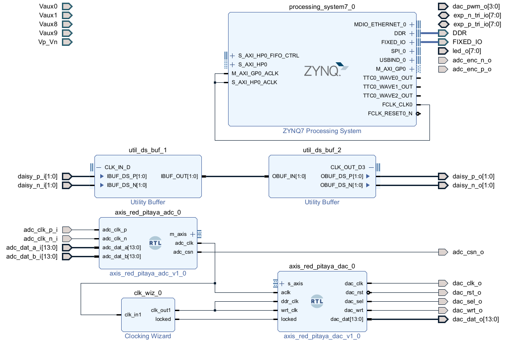
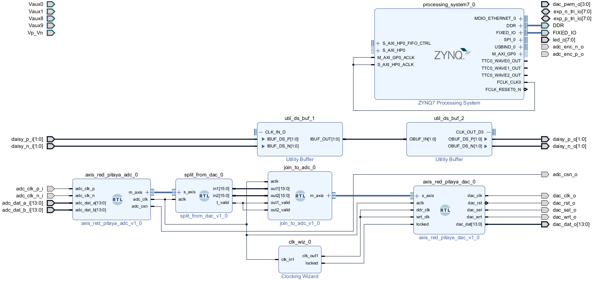

# Splitting and joining AXIS data

In the  [input signal feedthrough](/Tutorials/PROJ_IOFeedthrough) tutorial, we feed input data through to the output. The data is contained in a 32 bit AXI Stream combining the two signals. If you want to manipulate the signals individually, you need to split this up.

We'll use two custom source files `join_to_adc.v` and `split_from_dac.v` which you can download from this folder. The code behind these is explained in detail [here](/Tutorials/CORE_SPLIT_JOIN).

## Verilog blocks

Here we'll go through the verilog blocks used to split and re-combine the signal. The code behind these is explained in detail [here](/Tutorials/CORE_SPLIT_JOIN).

### split_from_dac.v

The first code splits the signal from the DAC into two 16 bit streams.

### join_to_adc.v

This block joins two streams into one

## Block design

Begin by creating the block design from [input signal feedthrough](/Tutorials/PROJ_IOFeedthrough). Make sure you remember to *Generate Output Products* and *Create HDL Wrapper*, and also set the wrapper for your main design as top.

### Add sources

On the left sidebar under *Project Manager* select *Add Sources*. Choose the *Add or create design sources* radio button and press *Next*. Then use the *Add Files* button to add  `join_to_adc.v` and `split_from_dac.v`. 

### Connect split_from_dac

Add *split_from_dac* to the block design. Connect its *m_axis* and *adc_clk* to the corresponding  

### Connect join_to_adc

Now add *join_to_adc* to the design. Connect it to *split_from_dac* as below

Then drag the *m_axis* port on *join_to_adc* to the *s_axis* port on *axis_red_pitaya_dac*.

The completed design should then look like:

Since we are just splitting and then recombining the input, this should behave just like a passthrough. Compile it and make sure it works! The fun will happen when we start filtering one of the channels.

## What's next?

- 