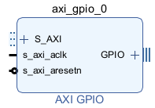
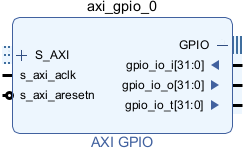
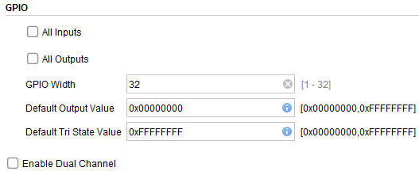
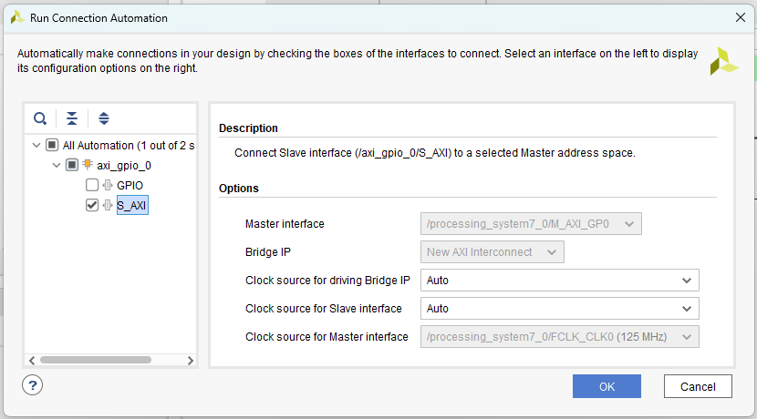
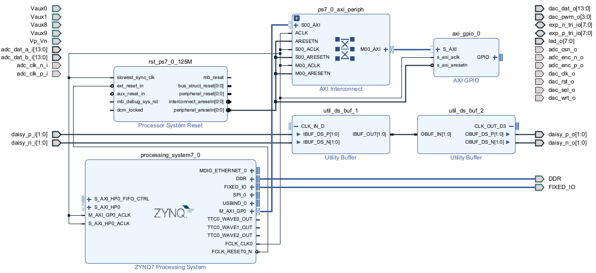
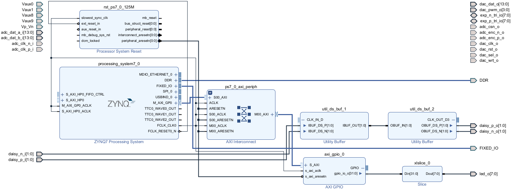

# Controlling the LEDs with AXI GPIO

One of the strengths of the Red Pitaya is that it incorporates both an FPGA, and a full Linux operating system. In this tutorial we'll learn how these two can communicate, allowing you to use the Linux terminal to control the FPGA and read out data. As a demonstration, we'll control the LED lights on the side of the Pitaya.

The Processing System (the CPU) and Physical Logic (FPGA) communicate using *AXI*, a protocol used in many systems, not just the Red Pitaya. There are two types of AXI on the Pitaya, a simple *General Purpose Input Output (GPIO)*, and a more complex *High Performance (HP)*. Is *GPIO* we will use in this tutorial. You can find an overview of the details [here](https://www.allaboutcircuits.com/technical-articles/introduction-to-the-advanced-extensible-interface-axi/), but most of the technicalities are taken care of by Vivado. You just need a general understanding to be able to use it, which is what we will focus on. In particular, AXI transfers data by referring to particular places in memory. Thus we will need to learn how computers index their memory, which is done in hexadecimal.

This tutorial is based on [‪Anton Potočnik's Stopwatch tutorial](http://antonpotocnik.com/?p=489265), Chapters 2.3, 10, and 19 of [The Zynq Book](http://www.zynqbook.com/), and the [Xilinx AXI Documentation](https://docs.xilinx.com/v/u/en-US/pg144-axi-gpio).

## Understanding AXI

The *Advanced eXtensible Interface (AXI)* is a common set of rules for transferring data. If a particular component, such as the ZYNQ7 Processing System, has an AXI port, you can transfer data to and from it without any knowledge of how the component works internally. You just use the standard AXI rules to ask for or send information, and the component will handle the rest.

### Red Pitaya's AXI ports

Let's begin by understanding the AXI ports on the ZYNQ7 Processing System:

There are four AXI ports on the left: *S_AXI_HP0_FIFO_CTRL*, *S_AXI_HP0*, *M_AXI_GP0_ACLK*, *S_AXI_HP0_ACLK*, and one on the right: *M_AXI_GP0*.

* The naming convention *M_* or *S_* refers to the [*master/slave* terminology in communications](https://en.wikipedia.org/wiki/Master/slave_(technology)). The *master* controls the transfer, either sending or asking for data. The *slave* then takes or provides this data. For the ports denoted *M_* the Processing System is the master, while for the ports denoted *S_* the external FPGA is the master.
* *GP* stands for *General Purpose*, a way to easily transfer small amounts of data. This is what we will use here to control the LEDs. If we tried to transfer large amounts of data however, such as the signal coming through the analog to digital converters, these would not be fast enough.
* *HP* stands for *High Performance*. These ports are more complicated to use, but can transfer large amounts of data. We'll get to them in a later tutorial. These transfer data using things called [*FIFO buffers*](https://nandland.com/lesson-8-what-is-a-fifo/).
* The *0* on the end of *GP0* and *HP0* signify that this is the first port on the device. If the ZYNQ had a second high performance port, it would be called *AXI_HP1*.
* *ACLK* stands for *AXI Clock*. When two different components are communicating, they need to synchronise when they send and receive data. This is difficult if they are using two different clocks, so these ports monitor the external clock signal to properly time the transfer. We will be interfacing the ZYNQ with FPGA code driven by *FCLK_CLK0*, so *ACLK* will be connected to *FCLK*.

These ports are quite complicated. You'll notice that some of them have a + symbol. Click this to expand the port, and you'll see that it is made up of many different wires. Thankfully Vivado can handle these connections for us.

### Memory addresses & hexadecimal

You transfer data via AXI by specifying specific addresses in memory to read from or write to. Thus we must take a moment to understand how computers refer to different parts of memory, and the hexadecimal number system. We'll give a brief overview here, and there are many good tutorials on the internet.

Computers store information in binary, as sequences of zeros and ones. A single digit is referred to as a *bit*. One bit is too small to contain anything useful. Therefore rather than working with individual bits, computers work with *bytes*, which are groups of eight bits. For example a byte of information may be

`10110010`,

which is made up of eight individual bits `1`, `0`, `1`, `1`, `0`, `0`, `1`, and `0`.

Each byte in a computer's memory is given an *address*. This is just a number associated with the byte, to uniquely identify it. The computer may receive an instruction to write some information to byte number 342, or you may ask to read bytes 1,765-1,768.

Data on a computer is stored in ones and zeros, which makes working in binary more convenient for a computer than working in base-ten. However, since binary only contains two digits, even small numbers can require long sequences of binary. For example, the number 56 is the sequence 111000. Since computers contain billions or trillions of bytes, each of which needs its own address, it would be impractical to write out memory addresses in binary.

Instead, memory addresses are written in *hexadecimal*, or base sixteen. Since sixteen is a power of two, this number system works very naturally with binary. But the extra digits let us practically address billions of bytes. If our computer has one gigabyte of memory, which is a billion ($10^9$) bytes, referring to each byte would require

* $\log(10^9)/\log(2)\approx 30$ digits of binary,
* $\log(10^9)/\log(10)=9$ digits of base-ten,
* $\log(10^9)/\log(16)\approx 8$ digits of hexadecimal.

With a terabyte, base ten would take twelve digits while hexadecimal would require ten. 

So how does hexadecimal work? Binary has two digits:

`0`, `1`

Base ten has ten digits:

`0, 1, 2, 3, 4, 5, 6, 7, 8, 9`

Hexadecimal, or base sixteen, requires us to add six more digits. The convention is to use the letters A to F, which gives us

`0, 1, 2, 3, 4, 5, 6, 7, 8, 9, A, B, C, D, E, F`

Here are some numbers written in binary, base ten, and hexadecimal. You can easily convert between the three on [this website](https://www.mathsisfun.com/binary-decimal-hexadecimal-converter.html).

| base ten          | hexadecimal   | binary                          |
| ----------------- | ------------- | ------------------------------- |
| 0, 1, 2, 3, 4     | 0, 1, 2, 3, 4 | 0, 1, 10, 11, 100               |
| 9, 10, 11, 12, 13 | 9, A, B, C, D | 1001, 1010, 1011, 1100, 1101    |
| 15, 16, 17, 18    | F, 10, 11, 12 | 1111, 10000, 10001, 10010       |
| 100, 1000         | 64, 3E8       | 1100100, 1111101000             |
| 32, 64, 128       | 20, 40, 80    | 100000, 1000000, 10000000       |
| 16, 256, 4096     | 10, 100, 1000 | 10000, 100000000, 1000000000000 |
| 350, 351, 352     | 15E, 15F, 160 | 101011110, 101011111, 101100000 |

Try and get used to the system by doing some conversions between base ten and hexadecimal. For example, `3E8` is converted to decimal as

$$3\times 16^2+(E\sim 14)\times 16^1 + 8\times 16^0=1000.$$

A memory address is just a number, written in hexadecimal. Typically hexadecimal numbers are preceded by `0x` to signify that they are in base sixteen. So if you see

`0x12AE`

this just means

$$1\times 16^3+2\times 16^2+(A\sim 11)\times 16^1+(E\sim 14)\times 16^0=4782,$$

or the $4782$ th byte in the memory. Adding leading zeros doesn't change anything, so this is the same as

`0x000012AE`

In the decimal system we use a comma to separate large numbers: $4,782$. Similarly in hexadecimal we use an underscore `_`:

`0x0000_12AE`

While it might look mysterious and technical written like that, remember that it's just a number, referring to a particular byte in memory.

### AXI GPIO memory layout

An *AXI GPIO* data transfer works by specifying addresses in memory to read from or write to. Data is transferred in blocks of $32$ bits, or $32/8=4$ bytes. Thus a single transfer will require four separate memory addresses.

When using *GPIO*, you'll be given a memory address specifying where to find the first byte of the data, for example `0x13A0`. Then the next three bytes are stored in the next three memory addresses: `0x13A1`, `0x13A2`, `0x13A3`. If you are reading data from the Red Pitya you read from these three addresses. If you are sending data to the Red Pitaya, you write to these four addresses.

How do you read or write from a particular address in memory? The Red Pitaya comes with a command line program called `monitor`. You can give this an address, tell it whether to read or write, and it will do this for you. You can call `monitor` from programs such as Python or MATLAB, and hence use these to control the Pitaya.

## Vivado design

Begin with the [base Vivado design](/Tutorials/SETUP_BaseCode).

### Create and configure AXI GPIO

Click the '+' button or *Right-click* to *Add IP*, and choose *AXI GPIO*. This will give you a block like this:

On the left are connections that go to the processing system, while the right is the *GPIO* channel to send and receive data. Click on the '+' after *GPIO* to expand it:

*GPIO* allows for 32 bits of data to be transferred in either direction. The port *gpio_io_i* is an input that can take data to the processing system, while *gpio_io_o* is an output that sends data from the processing system to the logic. The port *gpio_io_t* (where *t* stands for *tri state*) is used to carry information about whether each bit is to be used as input or output.

To set up the block, *Right-click -> Customize Block*. This will give you the following options

- If you tick *All Inputs*, this means the *GPIO* is used only in input mode. Then *gpio_io_o* and *gpio_io_t* will disappear, and you'll just be left with the input *gpio_io_i*.
- Similarly if you tick *All Outputs*, you'll just be left with *gpio_io_o*.
- If you tick *Enable Dual Channel* you get a second *GPIO* channel, allowing you to have two separate data inputs and outputs from your device.

For our first example we want to send data from the Linux terminal to the FPGA logic. So just tick *All Outputs*, then press *OK*.

### Connect GPIO to the Processing System

If you click the '+' to expand *S_AXI*, you'll see that it is made up of many different wires. All these need to be connected to the *Processing System* correctly, thankfully Vivado can do this for us. 

At the top of the block design you should see a green bar offering to *Run Connection Automation*:

Press this, and a dialog box should open. Tick *S_AXI*, leave the other options as default, then press *OK*:

At this point the design might be a mess, you can *Right Click -> Regenerate Layout* to have Vivado re-arrange things as it sees best.

There should now be two more blocks in your design. 

* *AXI Interconnect* handles the connection between the *Processing System*, and our *AXI GPIO* block.
* *Processing System Reset* makes sure the interconnect is initialised properly, and handles synchronisation issues if you are using several different clock signals.

Thankfully we don't have to worry about these two blocks.

### Set memory address

As mentioned earlier, the *AXI GPIO* works by writing to and reading from addresses in memory. To set the address, open the *Address Editor* tab:

The memory addresses that the *S_AXI* port has access to span from *Master Base Address* to *Master High Address*, which from *Range* we can see is 60 kilobytes. Since we can only transfer 32 bits or four bytes of data, this is way overkill. The *AXI* protocol has a minimum size of 4 kilobytes, so set *Range* to 4K. You should see *Master High Address* change accordingly.

Keep note of the *Master Base Address*, as this is the address you'll have to write to later. The output data will be stored in this and the next three bytes, in our case `0x4120_0000`, `0x4120_0001`, `0x4120_0002`, and `0x4120_0003`.

### Connect output to LEDs

Lastly, use a *Slice* block to connect the **first** seven bits (indices 7:0) of the *GPIO* to *led_o* . You'll have to expand the *GPIO* port to do this:

### Compile and run

Compile and run the code on the Pitaya as described in [our tutorial](/Tutorials/SETUP_Compiling), and run the bitstream using `cat`. If everything is right, nothing should happen just yet.

The Red Pitaya has a tool called `monitor` that you can use to read and write individual addresses. `ssh` into the Pitaya to use this. To find the current state of the LEDs, run

`> monitor 0x41200000`

`0x4120000` is the *Master Base Address* from the *Address Editor*. If yours was different, you'll have to use that instead. This will return the value stored at that memory address, which should be `0x00000000`.

To turn on the first LED, run

`> monitor 0x41200000 1`

This sets the memory at that address equal to 1, which in binary is a string of zeros ending in `1`. This should thus make a single LED turn on. If you set it equal to 2, which is a string of binary ending in `10`, you should see the second LED turn on. Play around with different numbers, and check that the lights which turn on match their binary expansion.

Be careful when using `monitor`, writing to random memory addresses could crash the device! It shouldn't be possible to do any permanent damage though, so if you run into any problems just re-start the Pitaya.

Congratulations, you can now control your Red Pitaya through the Linux interface!

## What next?

Being able to control the FPGA from Linux opens up a lot of possibilities! Try playing around with some of the pre-made IP blocks in Vivado, or write your own Verilog, and see what you can create. Can you make a binary clock whose speed you control?

As well as writing to memory, `monitor` can also provide real-time information about parameters such as temperature, and read/write to some of the analog ports. See the [official monitor documentation](https://redpitaya.readthedocs.io/en/latest/appsFeatures/command_line_tools/com_line_tool.html#monitor-utility) for more information.

See [‪Anton Potočnik's Stopwatch tutorial](http://antonpotocnik.com/?p=489265) for a more advanced application of *GPIO* using two channels, with both input and output. After this if you want to learn more about *AXI* you can read Chapters 2.3, 10, and 19 of [The Zynq Book](http://www.zynqbook.com/), and then the [Xilinx AXI Documentation](https://docs.xilinx.com/v/u/en-US/pg144-axi-gpio).