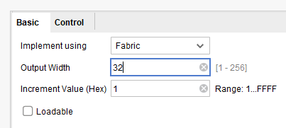
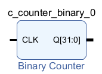
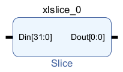
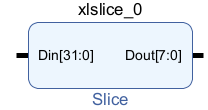
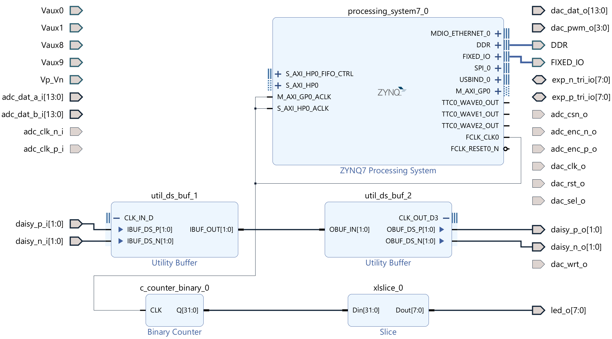

# LED Binary counter

The Red Pitaya has a series of LEDs on the side, which you can use to signal basic information. In this tutorial we'll see how to turn them into a simple binary counter. This is based on [Anton Potočnick's LED Blinker tutorial](http://antonpotocnik.com/?p=487360).

The blocks in Vivado represent basic elements which communicate with each other in binary. Programming an FPGA therefore requires a basic understanding of how binary works. You don't need to know how to program in 1s and 0s, since Vivado already has premade blocks that do the processing for you. You just need to manage how these talk to each other, and communicate with the ports. We'll introduce the required bits of binary as we go.


## Preliminaries

### Clock signals

Most digital circuits need a clock signal, which oscillates between 0 and 1 at a predetermined rate. This is a useful resource if you want to, for example, make some LED lights blink. It is also important for synchronisation. The diagram in Vivado represents a physical circuit the FPGA will replicate, and it will take electric signals different amounts of time to travel through the various connections. Circuit elements can wait one clock cycle in between processing, giving the signals time to catch up.

### Binary counters

The clock signal is too fast to drive the LEDs directly, so we have to slow it down. The simplest way to do this is with a *binary counter*. Lots of great expositions come up if you search "How to count in Binary", so we'll just give a brief overview here. 

Our regular number system is base ten. This means that we have ten digits that we count with:

0, 1, 2, 3, 4, 5, 6, 7, 8, 9

This lets us count from zero to nine. To go beyond this, we add an extra digit and repeat the process:

10, 11, 12, 13, 14, 15, 16, 17, 18, 19

When we run out of digits, we increment the first digit from 1 to 2. Eventually we'll reach 99, at which point we add a third digit:

98, 99, 100, 101, 102

and so on.

The *binary* system is base two. This means we have two digits which we count with:

0, 1

This lets us count from zero to one. To go beyond this we add an extra digit and repeat the process:

10, 11

Since we only have two digits to play with, at this step we have to add a third digit. The process then continues.

Let's look at how you count in Binary from zero to eight, adding some leading zeros to make our numbers four digits long:

```0000, 0001, 0002, 0003, 0004, 0005, 0006, 0007, 0008```

```0000, 0001, 0010, 0011, 0100, 0101, 0110, 0111, 1000```

The bottom row of four 0/1 digits is a *four-bit binary counter*. We could imagine them as four LEDs which are on/off to represent the digits 0/1. 

Suppose the binary counter ticks forward at a rate of one number per second.

* The rightmost digit oscillates between 0 and 1 at a rate of $1\mathrm{Hz}$, or equivalently $(1/2^0)\mathrm{Hz}$.
* The next digit from the right will oscillate between 0 and 1 at half this rate, i.e. $0.5\mathrm{Hz}$, or $(1/2^1)\mathrm{Hz}$.
* The third digit from the right will be $(1/2^2)\mathrm{Hz}$, 
* and the fourth will be $(1/2^3)\mathrm{Hz}$.

So if a binary counter is ticking forward at some rate $r\mathrm{Hz}$, the $n$ th digit from the right will oscillate between 0 and 1 at a rate of $(r/2^{n-1})\mathrm{Hz}$. 

**So to slow down a clock signal by $2^n$, we can use it to drive an $n+1$-bit binary counter, and then take the left-most digit.**

# Procedure

The *FCLK_CLK0* output on the *ZYNQ7* provides a binary signal which oscillates between 0 and 1 at a rate of 125MHz. We will feed the clock to a binary counter, take the leftmost digits, and use them to switch the LEDs on and off.

## 0. Base setup

First follow our [Base Vivado design tutorial](/Tutorials/SETUP_BaseCode/README.md) for the initial setup.


## 1. Add a binary counter

For the most part we don't want to program in binary. Fortunately, Vivado has a vast array of pre-made blocks called *IP*s. To add one, press the plus-shaped button:


Alternatively you can *Right-click -> Add IP*, or press *Ctrl + I*. 

Use the Search box to find a *Binary Counter*, which you can select by double clicking, or pressing the Enter key.


This should create a *Binary Counter* block in your design:


This has one input and one output:

* On the left, *CLK* signifies that this takes a clock signal.
* On the right the counter outputs a vector *Q* with sixteen bits, indexed from 15 to 0. It is typical for the 0th index to refer to the right-most component of the vector, rather than the left-most as in programming languages such as Python. To see why, look back at the binary counter. The right-most bit refers to the $2^0$ component, the next right-most to the $2^1$, and so on. So by indexing vectors from the right, the vector element $k$ represents the $2^k$ component.

## 2. Customise the Counter

The *FCLK_CLK0* on the ZYNQ7 processing system produces a signal oscillating at 125MHz, or $1.25\times 10^{8}$ times per second. Suppose we want to slow this down to 2 cycles per second. How many bits do we need in our counter?

$$\frac{1.25\times 10^8}{2^k}=\frac{1}{2},$$

$$\log(2^k)=\log(1.25\times 10^8)-\log(1/2),$$

$$k=\frac{\log(1.25\times 10^8)-\log(1/2)}{\log 2}\approx 27.9.$$

Thus our binary counter needs to be around 28 bits long.

Looking through the output ports in the Verilog design, we can see the one for the LEDs:


Since this is indexed from 7 to 0, it takes eight bits, representing eight LEDs. If you look closely at the LEDs on the Pitaya you can see that they are indeed numbered. There are more than eight LEDs, the extra ones are used by the Pitaya's internal software.

Since *led_0* needs eight bits, and we need a counter with about 28 elements, let's make a Binary Counter with 32 bits, and then feed the eight left-most bits to the LEDs. 

To change the properties of the Binary Counter, either double click it, or *Right Click->Customize Block*. Change the *Output Width* to 32:



After clicking *OK*, you should see this change reflected in the block:



## 3. Slice the output

Add another IP, this time choosing *Slice*:



Customise this block so that it takes an input vector of size 32, and then slices the bits from 31 to 24:


If you have the indices correct, *Dout Width* should automatically change to 8, representing an output size of 8 bits. After clicking *OK* you should see the changes reflected in the block:



## 4. Connect everything together

Click and drag to make wires connecting *FCLK_CLK0* → *Binary Counter* → *Slice* → *led_0[7:0]*. This should leave you with something like this:



You can try and tidy things up a bit, but it's difficult to make Vivado look the way you want.

* Clicking on a block, then pressing *Ctrl+R*, will rotate it.
* You can use the arrow keys to move blocks up and down.
* But dragging blocks sideways can rearrange your setup in unexpected ways.

Be careful, *Undo* seems to have trouble moving things back to how they were, so it's easy to end up with a messed-up design. If you've screwed up your design past the point of no return, try *Right-click -> Regenerate Layout*.

# What's next?

You now have a design that should make the LEDs blink as a binary counter! Next check out our tutorial on [compiling and running code](/Tutorials/SETUP_Compiling) to deploy it on the Red Pitaya.
