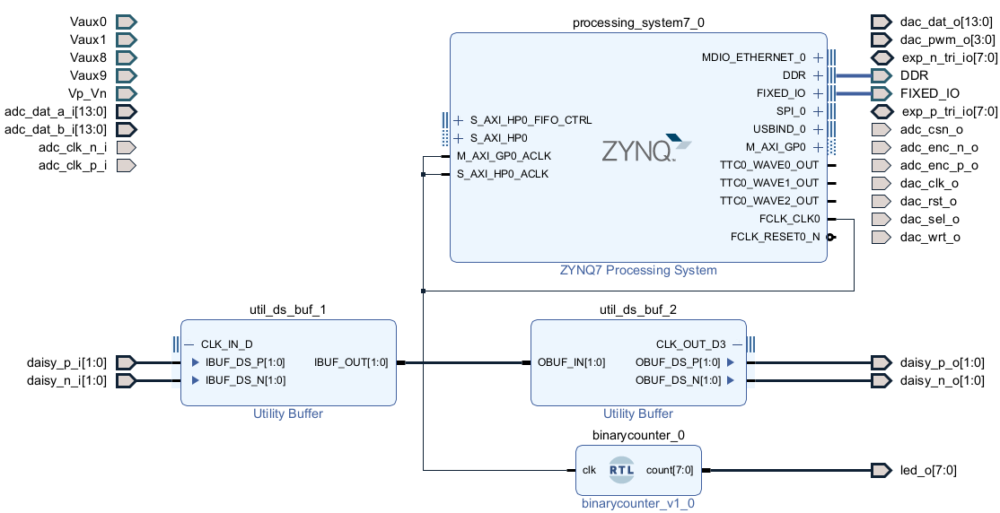

# LED binary counter with Verilog

In the [LED binary counter](/Tutorials/PROJ_LEDCounter) tutorial, we made our design by dragging and dropping pre-made blocks in Vivado. Often we will want to create our own blocks, which is done by writing code in *Verilog*. In this tutorial we'll use Verilog to implement the binary counter.

Verilog is a [Hardware Description Language](https://electronics.stackexchange.com/a/601671). Rather than telling a processor to do things, the code you write specifies a physical circuit that you want the FPGA to synthesise. If you want to learn Verilog, check out the [Further reading](/References). We'll try and describe here the bare minimum you need to understand the design.

## Design

Begin with the [basic Red Pitaya design](/Tutorials/SETUP_BaseCode).

### Adding a Verilog block in Vivado

To add a Verilog block, go to *Project Manager->Add Sources* in the sidebar on the left, choose *Add or create design sources*, then click next.

We want to create our own Verilog file, so choose *Create File*, give it a name (we'll call ours *binarycounter*), then press *OK* and *Finish*.


The next screen lets you configure the input and output ports. We'll do this ourselves in Verilog, so leave it at the default values and press *OK* (ignore the warning). You should now notice a new file has appeared under *Sources*, ending in `.v`:


### Verilog modules

If you double click the `.v` file, it should open in a new tab for editing. At the top of the file there will be a line defining the timescale:

```verilog
`timescale 1ns / 1ps
```

This sets the natural timescale for the code. The `1ns` tells Verilog that if we say *pause for two units of time*, we mean *pause for 1ns*. The second `1ps` gives the desired precision. If we say *pause for 0.3 units of time*, then it will pause for 0.3 nanoseconds, rounded to the nearest picosecond. [See here for more details](https://www.chipverify.com/verilog/verilog-timescale).

Next there will be several comments, denoted by `//`. At the bottom we have our Verilog module:

```verilog
module binarycounter(
	
	);
endmodule
```

This is what we use to describe the block's behaviour. 

**In what follows, keep in mind that we aren't defining a function like in a regular programming language. Rather, we are describing an electrical circuit.** If we write `a=b`, we don't mean "go to the location where `b` is stored in memory, and copy that value into the location where `a` is stored." Rather, we mean "synthesise a wire so that the electrical signal at `b` flows to `a`."

### Inputs and outputs

First let's specify the inputs and outputs. 

* The input is the clock signal, a single bit oscillating between `0` and `1`.
* The output is an 8-bit vector to pass to the `led_out`.

We write this as

```verilog
module binarycounter(
    input clk,
    output [7:0] count
	);
endmodule
```

* The names of our inputs and outputs `clk` and `count` are in principle arbitrary, you can choose whatever names you like.
  * However, Vivado will recognise any variable with `clk`  in the name as a clock signal. This doesn't usually change anything, but it is good practice.

* By default inputs are a single bit. So `input clk` means that there will be one input `clk` which is just a single bit.
* `[7:0] count` means that the output `count` will be eight bits long. Writing `[7:0]` means that index `0` refers to the right-most bit. We could have instead written `[0:7]`, in which case index `0` would refer to the left-most bit, but as described in the [LED Counter tutorial](/Tutorials/PROJ_LEDCounter) `[7:0]` makes the `k`th component of the vector correspond to $2^k$.

### Coding the counter

The clock signal oscillates at 125MHz, so we'll slow it down the same way as before. We'll use the clock to drive a 32 bit binary counter, and take as output the last eight bits of this. 

Remember that the module describes an electrical circuit. A clock signal flows in oscillating between zero and one, and a count flows out. For the circuit to act as a counter, it needs to have memory, so it can remember the current value of the count. There are many circuit components which can hold their current value. Physically, you need a nonlinear system with two steady states representing 0 and 1, or some persistent storage you can write values to. These are abstracted as circuit elements called *latches*, see [here](https://www.geeksforgeeks.org/latches-in-digital-logic/), or Chapter 7 of [LaMeres](https://www.amazon.com/Introduction-Logic-Circuits-Design-Verilog/dp/3030136078), for more information.

In Verilog values are stored in *registers* ([though these don't have to correspond to physical registers](https://stackoverflow.com/questions/33459048/what-is-the-difference-between-reg-and-wire-in-a-verilog-module)). We define a 32-bit register by writing:

```verilog
reg [31:0] count32 = 32'b0;
```

* `reg` means this is a register.
* The name `count32` for the register is arbitrary.
* `32'b0` initialises a 32-bit binary, and sets it to zero. A four-bit binary with value 1011 is created as `4'b1011`. We specified the binary should be 32 bits, but only gave a single `0`. By default, Verilog will left-pad the number with zeros to make up the remaining bits.
* Lines in Verilog terminate with a semicolon `;`

Every time the clock ticks over, we want to increment the count. To monitor the clock we use an `always` block

```verilog
always @ (posedge clk)
begin
    count32 = count32 + 1;
end
```

- `always @ (clk)` means "whenever `clk` changes, do the following"
- `always @ (posedge clk)` means "whenever `clk` changes from `0` to `1`, do the following". The code will be executed when there is a *positive edge* on `clk`, but not when `clk` changes from `1` to `0`.
- `always` blocks are contained within a `begin` and `end`.
- The body increments the count by one. When the value of the `count32` grows larger than what can be represented in 32 bits, it will wrap around back to zero.

Finally, we need to send the last eight bits of `count32` to the output:

```verilog
assign count = count32[31:24];
```

- Think of `assign` as connecting the two with a physical wire. Whenever `count32` changes, the value of `count` will automatically change with it.

All together the code is:

```verilog
module binarycounter(
	input clk,
	output [7:0] count
	);
	
    reg [31:0] count32 = 32'b0;
    
    always @ (posedge clock) begin
    	count32 = count32 + 1;
    end
    
    assign count = count32[31:24];
endmodule
```

Again try not to see this as a series of statements to be executed in order by a processor. Rather this describes a physical circuit that will be synthesised, with one wire going in and eight wires going out. When an oscillating clock signal is sent down the input, the eight output wires will give voltages corresponding to a binary counter.

Make sure you save the code before proceeding!

### Adding the block

Click on the *Diagram* tab to go back to the block design. Right-click the canvas and select *Add Module*, then click on the module you created before (*binarycounter* in our case) and press *OK*. Alternatively you can just drag and drop the code file from *Sources* onto the canvas.

Click and drag from the ports to connect the input to *FCLK_CLK0* and the output to *led_0[7:0]*:



That's your binary counter!

## What's next?

You're now ready to [compile and run your design](/Tutorials/SETUP_Compiling), or [test it out in the simulator](/Tutorials/PROJ_LEDSimulating).

If you want to try a more complex example see [Anton's Knight Rider lights tutorial](http://antonpotocnik.com/?p=488784), which also has a nice demonstration of parallel execution on the FPGA.