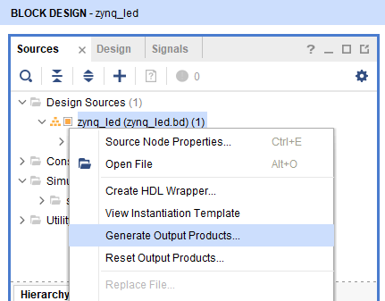
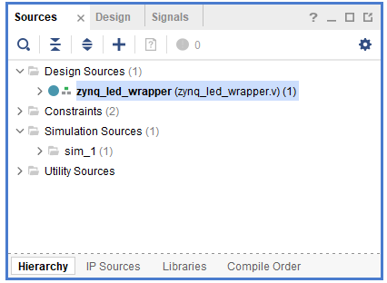

# Compiling and Running on the Pitaya

In this tutorial we will look at how to compile a design in Vivado into binary code which you can run on your device.

# Procedure

Begin by making a design in Vivado, such as our [LED Binary Counter](/Tutorials/PROJ_LEDCounter/README.md).

## 1. Generate output products & wrapper

We first need to convert our block design into something that can be compiled into bits. Under *Design Sources*, right-click your *Board Design* and select *Generate Output Products*:

Leave everything as default. You should see *Synthesis Options* is set to *Out of context per IP*. This means that if you later change the design and recompile, Vivado will be clever and only compile the bits you changed, saving time. When it finishes, you'll get a dialog box about "Out-of-context module runs", just click *OK*:

Now right-click again and choose *Generate HDL Wrapper*:

You should now have a new wrapper file ending in "*.v*". Your constraints file contained information on how the ports in the block diagram corresponded to the physical pins on the Red Pitaya. This new file converts this information into a format the compiler can understand.

**If you modify the design you don't have to repeat these steps, since Vivado will update the wrapper automatically.**

## 2. Generate Bitstream

We are now ready to convert our design into ones and zeros! Click on *Generate Bitstream* button on the bottom of the left sidebar:

**It may not look like anything is happening, because the progress indicator in Vivado is tucked away in the upper-right.** There is a little status indicator, which lets you know that the compiler is running. 

Wait until this finishes:

You will get a dialog box saying *Bitstream Generation successfully completed*. If you click *OK* it will open up a low-level view of the device, you can get back to where you were by clicking *Open Block Design* on the left sidebar.

## 3. Running on the Pitaya