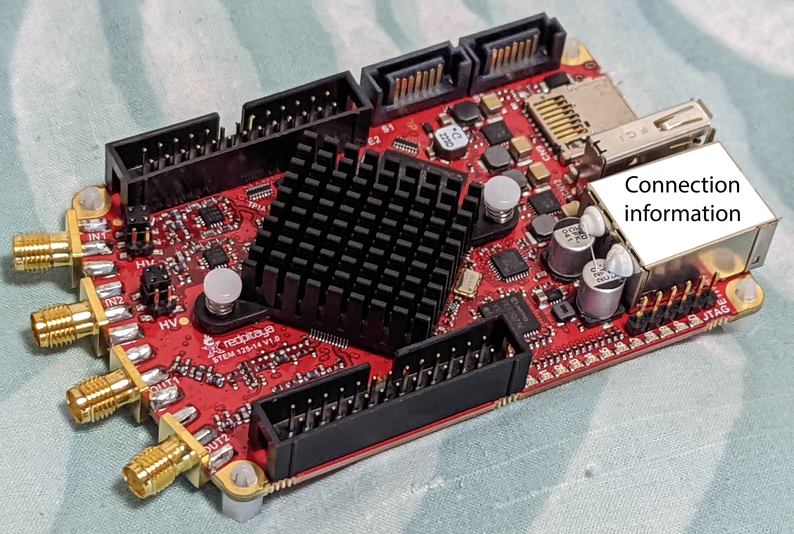
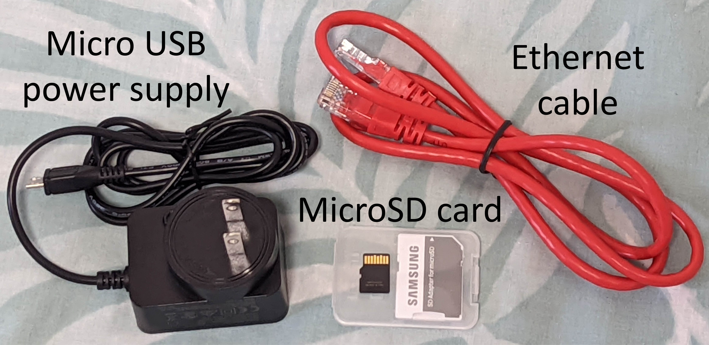
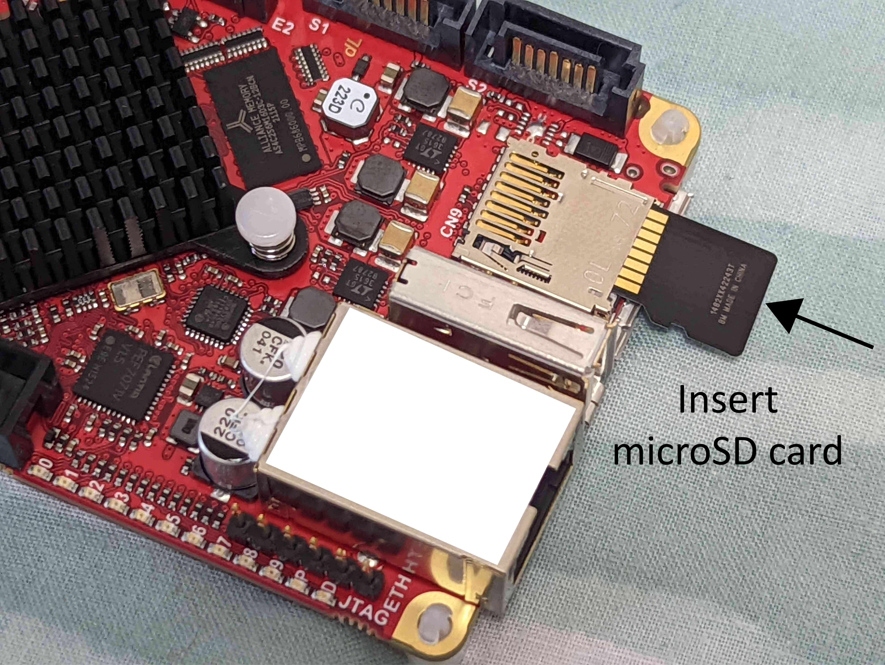
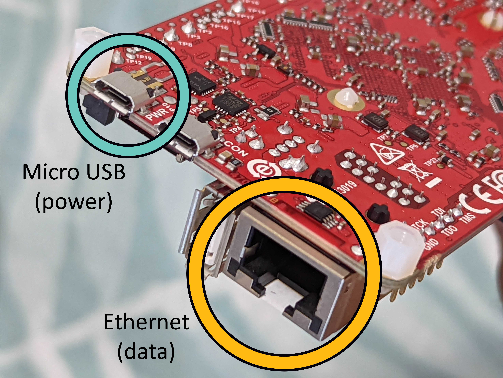
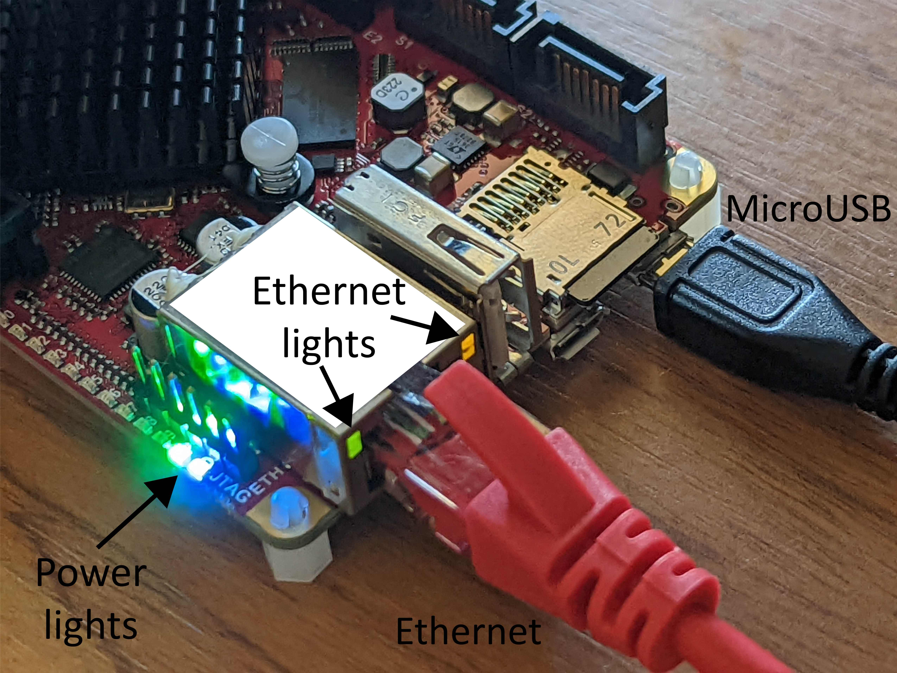
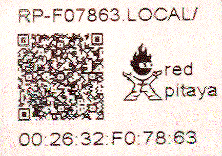

# Setting up a Red Pitaya

In this tutorial we'll go through the basic setup of a new Red Pitaya.

## What you need out of the box

The Red Pitaya looks like this:

On your Pitaya there will be a sticker over the rectangular ethernet port, which we have covered with a white square and labelled 'Connection Information'. Yours will contain information needed to connect to your Pitaya over the network.

In addition to the Red Pitaya, you also need the
* power supply,
* ethernet cable,
* and the micro SD card containing the operating system.

## Plugging things in

You first need to insert the microSD card containing the operating system. Before this  , **we recommend updating the operating system to version 1.04**, see [the official instructions on how to do this](https://redpitaya.readthedocs.io/en/latest/quickStart/SDcard/SDcard.html#). Old versions of the software can sometimes have trouble connecting to the network. **And the recently released version 2 is not compatible with these tutorials, for reasons we haven't had the time to look into yet.** Once you've updated your microSD card, insert it as below. It should make a satisfying click.

We will now use two of the ports on the rear:

* The board has two micro USB ports. The outer one is labelled 'PWR', and is used to supply power. The inner one, labelled 'CON', [can be used to transfer data with the computer](https://redpitaya.readthedocs.io/en/latest/developerGuide/software/console/console/console.html), though we won't be doing that. The official recommendation is to supply power using the included power supply. You can instead connect the PWR port to your computer with a micro USB cable, and it will also transfer power (but not data) to the board. We've done this many times without problem, but the company warns that if the port doesn't provide enough power the Pitaya could behave incorrectly. A similar warning applies if you use a different power supply.

* The rectangular port is ethernet, which exchanges data with the computer. You can connect this directly to your computer if you have a spare ethernet port, and we've also used ethernet to USB adaptors without issues. **Note that if you are on Linux, you have to set the Pitaya's network connection to 'Share to other computers' as mentioned in [the documentation](https://redpitaya.readthedocs.io/en/latest/quickStart/connect/connect.html).** Another option is to connect this to an ethernet port on your router. This lets you access the Pitaya from any other device on the network &mdash; even wireless ones like a phone or laptop. 

When you plug these cables in, LED lights will appear:
* The LED lights on the side turn on as soon as power is connected. 
* If the ethernet is communicating properly with your PC or network, red and green lights on the face of the port will start flashing.

The Pitaya gets quite hot after being plugged in for a few minutes, even if you aren't doing anything with it.

## Accessing the Pitaya via web browser

The sticker above the ethernet port, called 'Connection information' in previous pictures, will look something like this image from the [official documentation](https://redpitaya.com/rtd-iframe/?iframe=https://redpitaya.readthedocs.io/en/latest/quickStart/first.html):

The bottom sequence,  twelve numbers and letters separated by colons, is the _MAC address_ of the ethernet port. Every device that can connect to a network, such as your cellphone, has a unique MAC address associated with it. On the top of the sticker there is a web address, made up of *rp-*, followed by the last six digits of your MAC address, and then *.local/*. In this case you enter _rp-f07863.local/_ into your web browser (it doesn't matter if you use capitals or lowercase). This should take you to the console:

You're now connected! You can click on these buttons to use the various tools the Red Pitaya comes with.

## Conclusion

Hopefully you can now access your Red Pitaya, and control it via the web browser. If you do have issues check out the [official documentation on getting started](https://redpitaya.readthedocs.io/en/latest/quickStart/quickStart.html). The two main things to look out for are 

* updating the SD card beforehand to **version 1.04**, and 
* changing the network settings if you are using Linux.

Now check out some of the other [Tutorials](/Tutorials/HOME_Tutorials/)!
