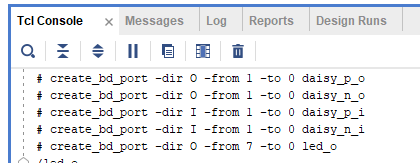

# Running Tcl scripts

Vivado uses a language called *tcl*. Suppose you want to run a long set of commands over and over again, such as describing all the ports in a Red Pitaya. You can combine them all into a tcl script, which you run at the beginning of your project.

To execute tcl scripts, use the *Tcl Console* at the bottom of the screen:

First you need to navigate in the console to the directory containing the script.
*	You can use the command `pwd` (this stands for *Print Working Directory*) to see what folder you are currently in.
*	Use `cd [directory]` (*Change Directory*) to change to the folder containing the script, where in this case *[directory]* will be something like *C:/Users/...*. 

Next you run the script using `source [scriptname.tcl]`. 

## Notes for Windows
The Tcl Console uses forward slashes for directories, like Mac and Linux. Windows however uses back slashes. If you are using Windows and don’t want to manually change all your slashes, you can simply surround your file path with curly braces *{}*, i.e. `cd {C:\Users\...}`.
